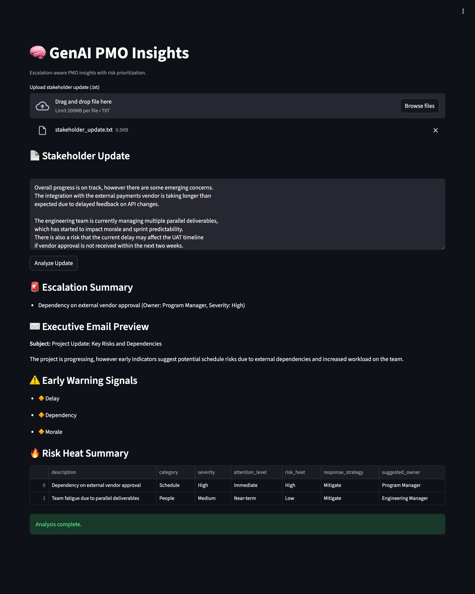

🧠 GenAI PMO Insights

GenAI PMO Insights is a lightweight, privacy-first decision support tool for PMOs.
It converts unstructured stakeholder updates into escalation signals, prioritized risks and clear action guidance — helping leaders focus on what actually needs attention.

## Screenshot

*Escalation summary, early warning signals and risk heat prioritization generated from a single stakeholder update.*

This is not an AI summarizer.
It is designed for governance, predictability, and decision-making.

What It Does

From a plain-text stakeholder update, the tool produces:

🚨 Escalation Summary – what needs leadership attention now

⚠️ Early Warning Signals – delay, dependency, morale, cost

📊 Structured Risks – category, severity, owner

🧭 Response Guidance – recommended action and accountability

🔥 Risk Heat Indicator – priority based on severity × attention

All outputs are review-ready and PMO-aligned.

Why This Exists

In real programs:

Stakeholder updates are noisy

Escalation is subjective

Risks are discovered too late

This project explores how GenAI + deterministic logic can support PMOs by:

Surfacing weak signals early

Making escalation criteria explicit

Turning insight into action, not more text

Architecture (Hybrid by Design)

LLM-first for interpretation and insight generation

Deterministic fallback when AI is unavailable or unreliable

This ensures:

Predictable behavior

Explainable decisions

Enterprise-ready degradation

AI is used where it helps — never where it becomes a dependency.

Key Design Principles

Intelligence before automation

Explicit escalation logic

Structured, typed outputs (no AI blobs)

Privacy-first (no data persistence)

Project Structure
genai-pmo-insights/
├── app.py                  # Streamlit UI
├── schemas.py              # Typed output models
├── services/
│   ├── analysis_service.py # Orchestration & escalation logic
│   ├── llm_service.py      # Optional LLM integration
│   └── fallback_service.py # Deterministic fallback
├── sample_inputs/
│   └── stakeholder_update.txt
└── requirements.txt

Privacy & Data Handling

No database

No file storage

No user tracking

All processing is in-memory

Designed to be safe to demo and reason about.

Run Locally
git clone https://github.com/<your-username>/genai-pmo-insights.git
cd genai-pmo-insights
pip install -r requirements.txt
export OPENAI_API_KEY="your_api_key"   # optional
streamlit run app.py

The app works with or without an API key.

v1 Scope (Intentionally Limited)

This version focuses only on decision intelligence:

Single stakeholder update analysis

Deterministic escalation and prioritization

No workflow automation or notifications

Future versions may explore visualization, trends, or integrations.

About the Project

Built by a technical PM / TPM with an engineering background, focused on practical GenAI for delivery governance — not demos or prompt experiments.

License

MIT

Final note

This project is intentionally opinionated.
It prioritizes clarity, explainability, and PMO realism over feature breadth.